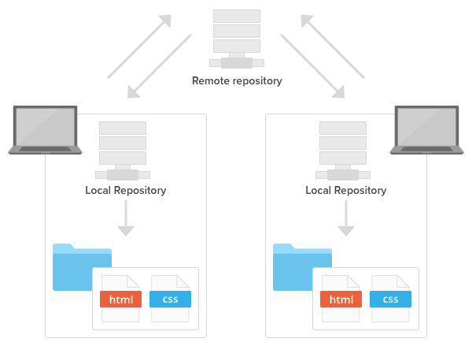

- [What is `git`?](#what-is-git)
  - [1. Snapshot](#1-snapshot)
  - [2. The Three States](#2-the-three-states)

# What is `git`?

> Git is an Open Source Distributed Version Control System.

Từ định nghĩa trên dịch ra tiếng Việt thì nó có nghĩa là: "Git là một hệ thống quản lý phiên bản phân tán".

Git chủ yếu được dùng để lưu trữ source code và toàn bộ lịch sử thay đổi của nó. Ngoài ra Git có Remote Repository (repo được lưu trên server) và Local Repository (repo được lưu trên máy tính cá nhân của các devlopers), nó cho phép chúng ta truy suât source code ở bất cứ đâu. (Mình sẽ giải thích rõ hơn trong phần [04 Working with remotes](./04-working-with-remotes.md))

## 1. Snapshot

Rồi! Ở phần này mình sẽ giúp các bạn hình dung cơ chế Git lưu trữ code và lịch sử như thế nào. Hãy cùng xem hình bên dưới đây:

> Git thinks of its data more like a series of snapshots of a miniature filesystem. With Git, every time you commit, or save the state of your project, Git basically takes a picture of what all your files look like at that moment and stores a reference to that snapshot. To be efficient, if files have not changed, Git doesn’t store the file again, just a link to the previous identical file it has already stored. Git thinks about its data more like a stream of snapshots.

## 2. The Three States

Đây là phần rất quan trọng, ae chú ý nha! : )

Khi làm việc với Git, các files sẽ có 1 trong 3 trạng thái sau: **modified, staged,** and **committed**.

- Modified: bạn thay đổi file nhưng chưa add vào staged, hoặc commit.
- Staged: bạn thay đổi file và đánh dấu thay đổi này sẽ được bao gồm trong commit sắp tới.
- Committed: data đã được lưu trữ trên local database.

- Working Directory: một phiên bản của project. Những file này đc pulled out từ Git directory và place on disk để chúng ta có thể thay đổi.
- Staging Area: là 1 file được lưu trong git directory, lưu trữ thông tin cho lần commit sắp tới. (file này có tên là index trong .git folder)
- Git directory: nơi git lưu trữ metadata và object database của project.
